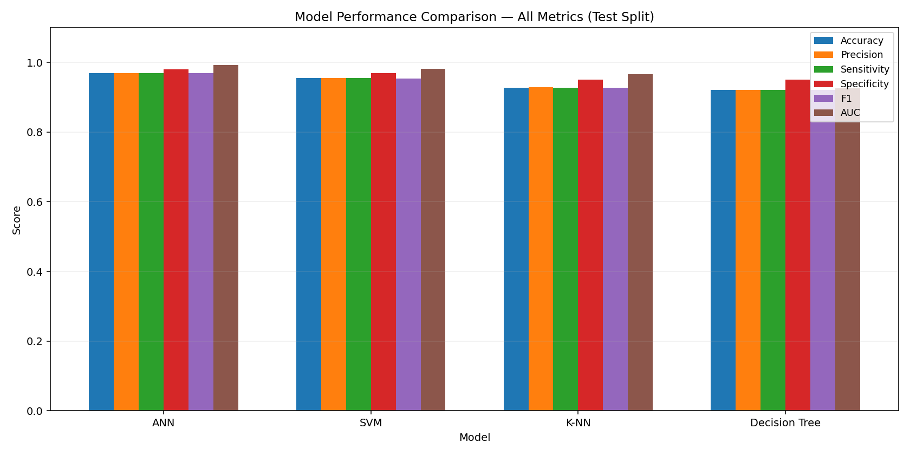

# Stellar Object Classification

Machine learning pipeline that classifies astronomical objects (star, galaxy, or quasar) from photometric and spectral measurements. Best model (neural network) achieves **96.96% accuracy** on 20,000 held-out test samples.



## Results

Test set performance across all four classifiers:

| Model         | Accuracy | F1    | AUC   |
|---------------|----------|-------|-------|
| **ANN**       | **96.96%** | **96.93%** | **99.25%** |
| SVM           | 95.47%   | 95.41% | 98.21% |
| K-NN          | 92.78%   | 92.72% | 96.62% |
| Decision Tree | 92.16%   | 92.15% | 92.64% |

## What It Does

Uses the [Sloan Digital Sky Survey DR17 dataset](https://www.kaggle.com/datasets/fedesoriano/stellar-classification-dataset-sdss17) (~100,000 observations) to build a three-class classifier (STAR / GALAXY / QSO) from 8 photometric and positional features. The pipeline preprocesses the raw data, reduces it to 5 principal components capturing 99.6% of variance, then trains and evaluates four classifiers. All outputs — trained models, metrics, predictions, and plots — are generated automatically by running a single script.

## How to Run

```bash
git clone https://github.com/adamrodi/CMPS4700_Group_B.git
cd CMPS4700_Group_B
python3 -m venv venv && source venv/bin/activate
pip install -r requirements.txt
python3 code/pipeline.py
```

All outputs are written to `code/output/` and `code/model/`.

## How It Works

- **Preprocessing** — Drops identifier columns, applies stratified 60/20/20 train/val/test split, and z-score scales features (fit on training data only to prevent leakage).
- **Feature Extraction** — Computes an 8×8 Pearson correlation matrix, then fits PCA on the training split; 5 components capture 99.6% of variance and are used as classifier inputs.
- **Classification** — Trains ANN, SVM, Decision Tree, and K-NN on the 5 PCs; evaluates each on all three splits using accuracy, precision, recall, specificity, F1, and AUC.

## Repository Layout

```
code/
  pipeline.py          — runs the full pipeline end-to-end
  preprocess.py        — PA1: cleaning, splitting, scaling
  feature_extract.py   — PA2: correlation analysis, PCA
  classifier.py        — PA3: model training and evaluation
  input/               — raw CSV + train/val/test splits
  output/              — plots, Excel exports, predictions
  model/               — serialized models + parameter JSON files
docs/
  submissions/         — final report and presentation
```

## Authors

Adam Rodi & Ron Logarbo — CMPS 4700, Group B
